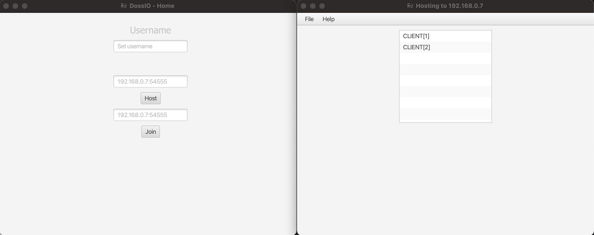

# DossIO


[](https://github.com/RivelBop/DossIO/blob/main/LICENSE)
[](https://www.java.com/en/)
[](https://youtube.com/@rivelbopstudios?si=shcOqJwOUVDv4Lgd)

Open Source Java software for distributed collaborative software development.



## Cross-Platform Desktop Collaboration Software

**DossIO is a cross-platform desktop collaboration software based on [JavaFX](https://openjfx.io/)
and [Kryonet](https://github.com/crykn/kryonet), designed for Windows, Linux, and macOS.** It allows
users to synchronize files locally and run projects on device.

## WARNING

**This project is in early development and may contain bugs and/or incomplete features. Use at your
own risk!**

Currently, DossIO is not recommended for production use. Please report any issues you encounter on
the [GitHub Issues Page](https://github.com/RivelBop/DossIO/issues).

DossIO is unstable on non-Unix systems (Windows). Use at your own risk.

### Missing Features

- Security (data encryption, control clients joining, etc.)
- Toggling .gitignore files
- More File Support (binary files, images, etc.)
- File Modification Indicators (per user)
- And More!

## Quick Start

1. Download the latest release from
   the [Releases Page](https://github.com/RivelBop/DossIO/releases) (or
   [latest](https://github.com/RivelBop/DossIO/releases/latest)).
2. Ensure you have [JDK 21](https://www.oracle.com/java/technologies/downloads/#java21) installed on
   your system.
3. Double-click the JAR file if your system is configured to run JAR files with Java. Alternatively,
   run the downloaded JAR file using the command:
   ```bash
   java -jar DossIO-platform-x.y.z.jar
    ```
   Replace `platform` with the OS you are using and `x.y.z` with the actual version number of the
   downloaded file.
4. Follow the on-screen instructions to set up your server or connect as a client.
5. Start collaborating!

## Contributing

We welcome contributions! If you're interested in building the project from source, fixing a bug, or
adding a feature, please read our [CONTRIBUTING.md](.github/CONTRIBUTING.md) file for setup
instructions and development guidelines.